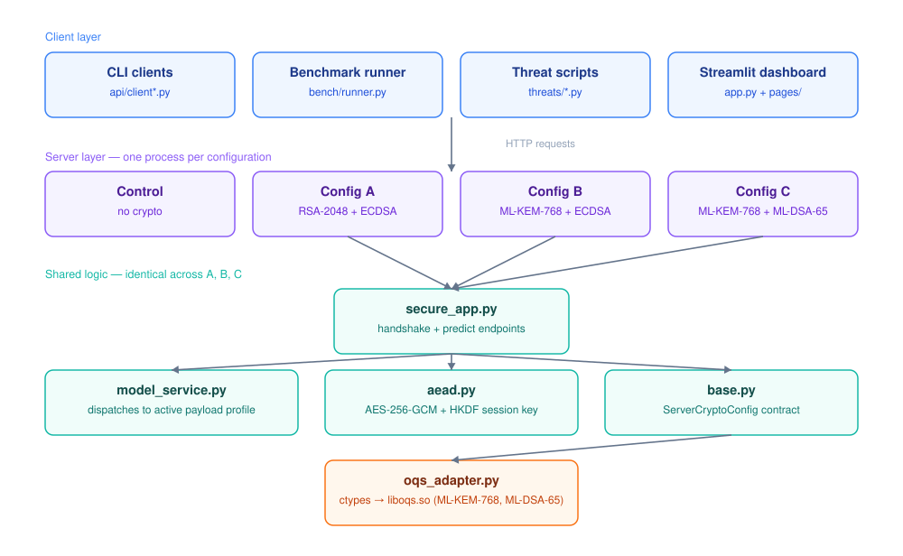
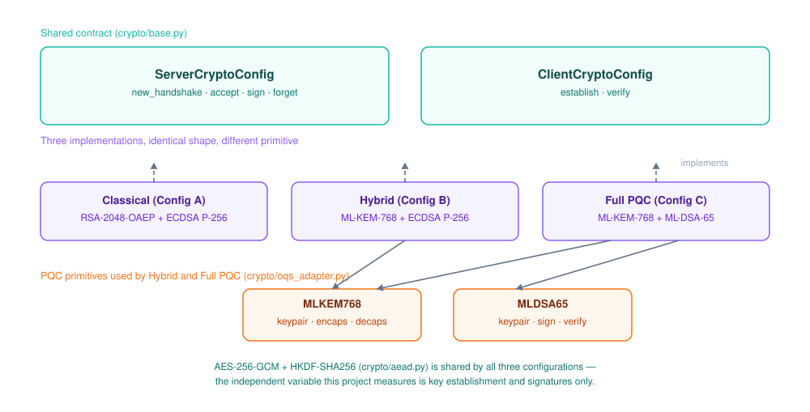
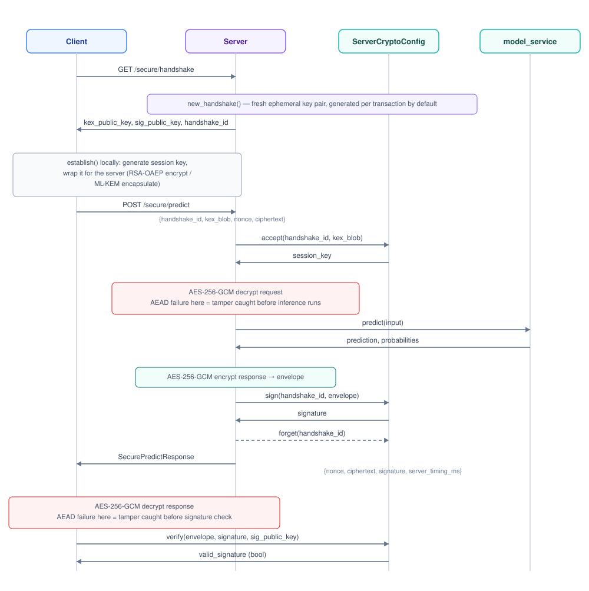
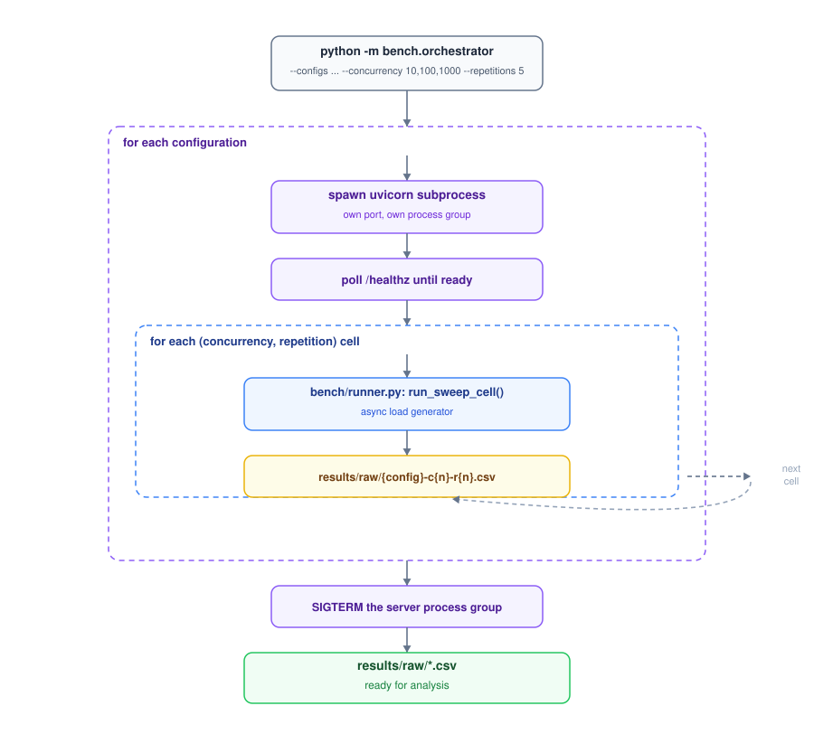
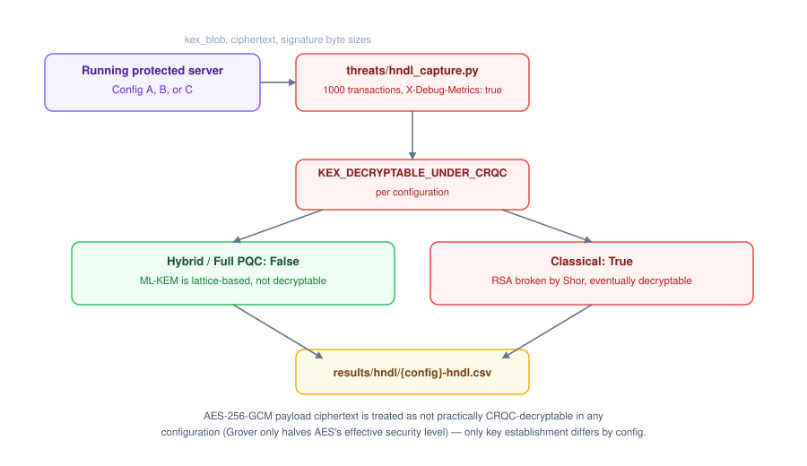
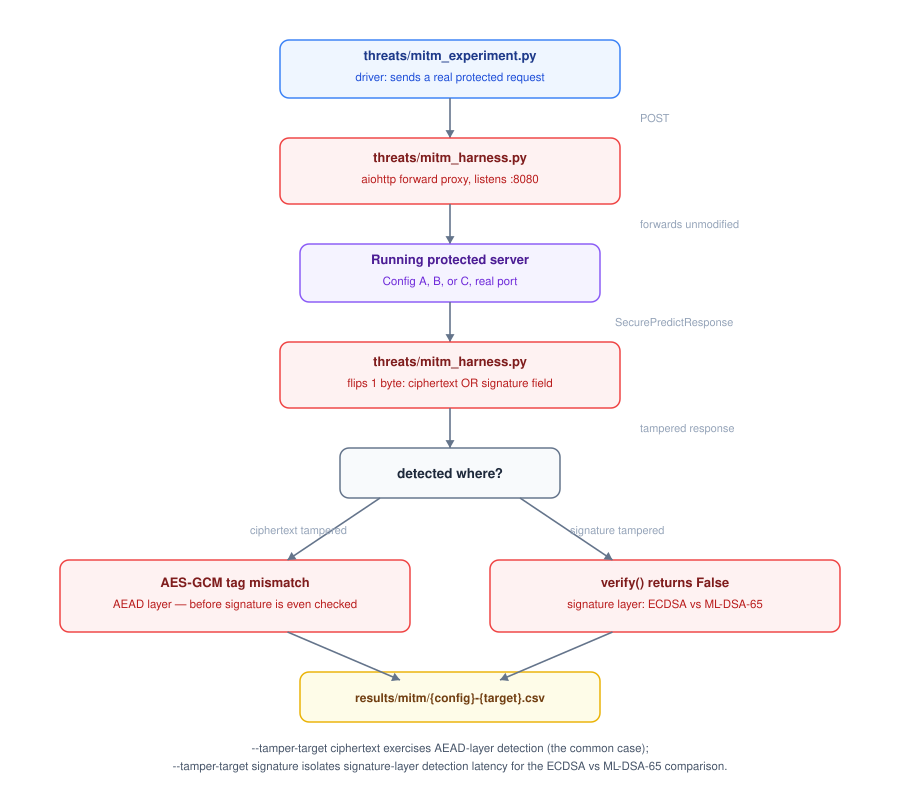
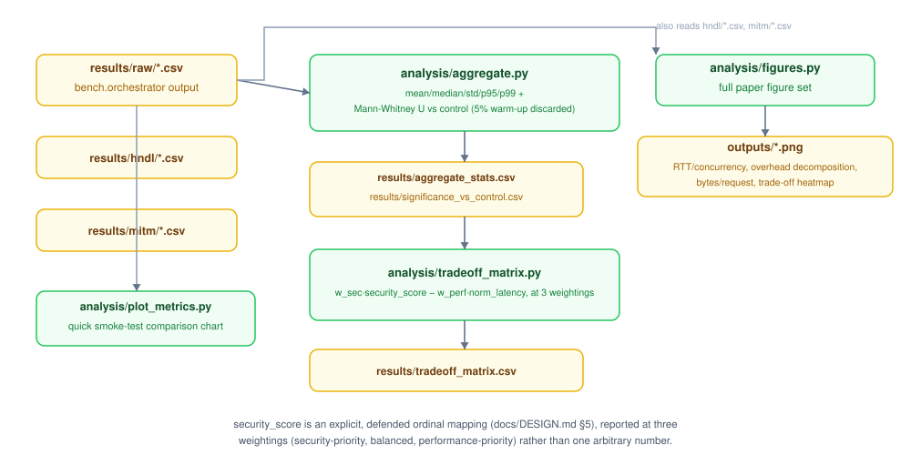
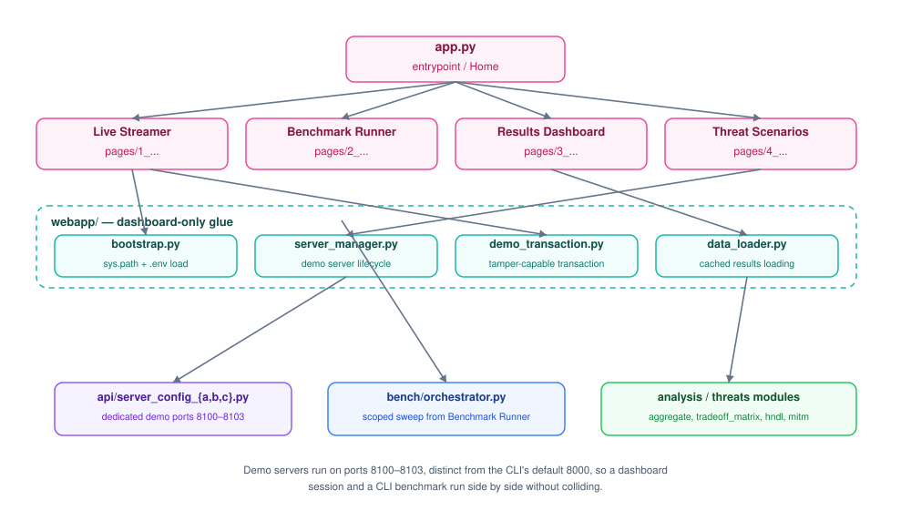
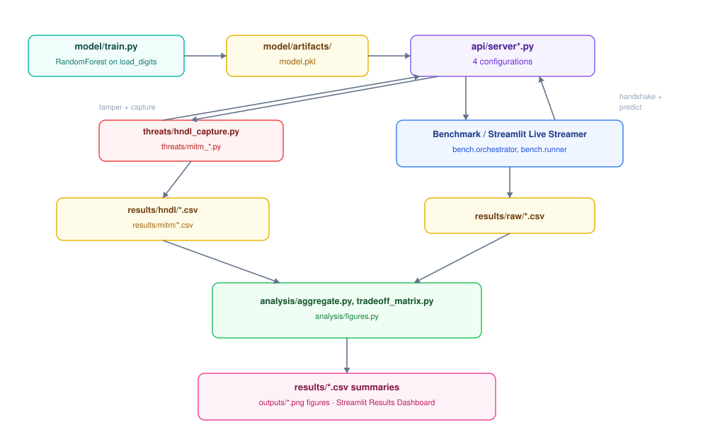
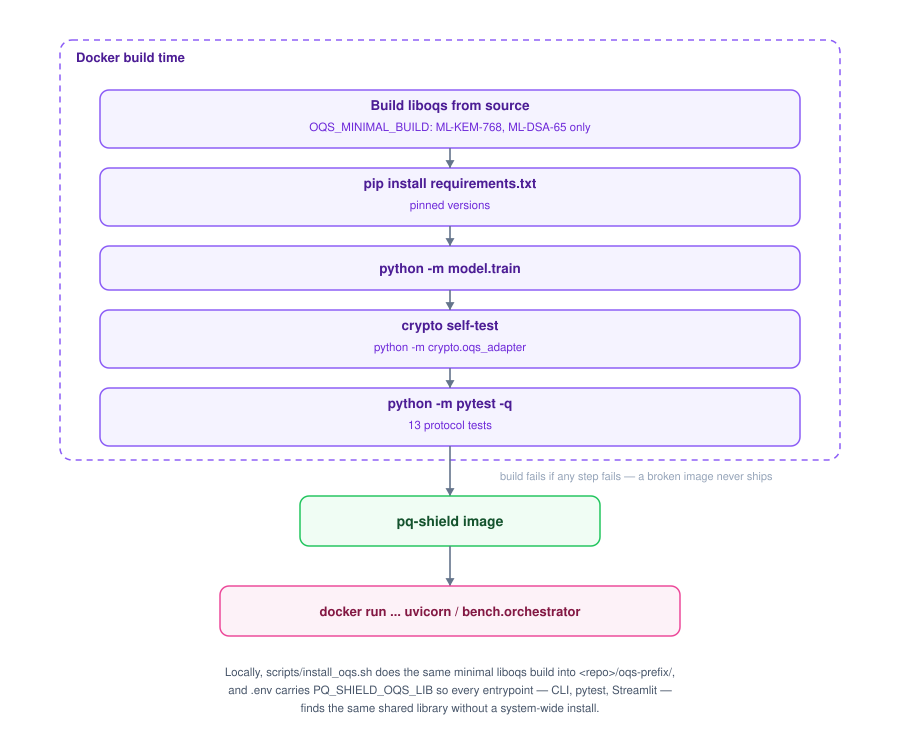

# PQ-Shield Architecture

This document describes how PQ-Shield is put together: the module layers, the
crypto abstraction the three *protected* configurations share, the request
lifecycle of a single protected transaction, the benchmark/threat/analysis
pipelines, and the Streamlit dashboard that sits on top of all of it. See
[`README.md`](README.md) for setup/usage and [`docs/DESIGN.md`](docs/DESIGN.md)
for the research hypotheses and protocol design rationale — this file is the
"how the code is structured and how data flows through it" companion to both.

Diagrams are static SVGs under [`docs/diagrams/`](docs/diagrams/), generated
once and committed — they render identically on GitHub, in an editor preview,
or in a PDF export, with no client-side rendering dependency.

## 1. System overview

Four configurations wrap the *same* FastAPI inference workload: an unprotected
**Control** baseline, plus three protected configs (**A**, **B**, **C**,
introduced in §2) that add a crypto layer on top. Only that crypto layer
differs between the protected configs; the model, the AEAD cipher, the
endpoint logic, and the benchmarking/analysis code are shared by all four.

## 2. The crypto configuration abstraction

`crypto/base.py` defines one contract (`ServerCryptoConfig` /
`ClientCryptoConfig`) that the three protected configs' modules —
`classical.py` (A), `hybrid.py` (B), and `full_pqc.py` (C) — each implement
identically in shape, differing only in which primitive they call. This is
what lets `api/server_config_{a,b,c}.py` and the bench orchestrator swap
configurations by import alone, with zero branching logic anywhere else in
the request path.

All three configs delegate AES-256-GCM payload encryption to the *same*
`crypto/aead.py` module (`derive_session_key` via HKDF-SHA256, then
`aead_encrypt`/`aead_decrypt`). That keeps the independent variable
restricted to key establishment and signatures — the thing PQ-Shield is
actually measuring — instead of letting symmetric-cipher choice confound
the comparison.

| Config | Key establishment | Signature | Symmetric layer |
|---|---|---|---|
| Control | *(none — plaintext baseline)* | *(none)* | *(none)* |
| A — Classical | RSA-2048-OAEP | ECDSA P-256 / SHA-256 | AES-256-GCM (shared) |
| B — Hybrid | ML-KEM-768 (FIPS 203) | ECDSA P-256 / SHA-256 | AES-256-GCM (shared) |
| C — Full PQC | ML-KEM-768 (FIPS 203) | ML-DSA-65 (FIPS 204) | AES-256-GCM (shared) |

## 3. Anatomy of one protected transaction

Every protected config runs the same five-step transaction shape: handshake →
establish → encrypt+POST → decrypt+verify, with a fresh ephemeral key pair
generated **per transaction** by default (the conservative, worst-case
measurement — see `docs/DESIGN.md` §4.2 for the "warm connection" variant).

Timing is captured at every stage on both sides (`crypto/instrumentation.py`'s
`Timer`) and returned in `server_timing_ms`, so a single transaction yields
per-stage costs (`decapsulate_ms`, `inference_ms`, `encrypt_ms`, `sign_ms`,
`server_crypto_ms`, `server_total_ms`) as well as end-to-end RTT — this is the
raw material every downstream benchmark and figure is built from.

## 4. Benchmark pipeline

`bench/orchestrator.py` drives the full concurrency × repetition ×
configuration matrix. It never runs two configurations' servers at the same
time — each gets its own process, its own port, a health check, a sweep, then
a clean shutdown — so results are never confounded by CPU contention between
configs.

`bench/runner.py`'s single-cell mode (`python -m bench.runner`) can also be
pointed at an already-running server for ad-hoc measurement, optionally
attaching CPU%/RSS sampling via `--server-pid`
(`crypto/instrumentation.ResourceSampler`).

## 5. Threat experiments

Two adversary models are each implemented as their own script, written
against the `ServerCryptoConfig`/`ClientCryptoConfig` contract rather than
against any one config directly. That means neither script needs
config-specific code — both drive all four configs through the same shared
transaction helper (`api/secure_client.py`).

### 5.1 Harvest-now-decrypt-later (HNDL) — passive capture

This isolates two different questions per config: how many bytes an
adversary would have to *store* today, versus how many of those bytes are
expected to become *decryptable* once a cryptographically-relevant quantum
computer (CRQC) exists. The AES-256-GCM payload ciphertext is treated as
not practically CRQC-decryptable in any configuration (Grover only halves
AES's effective security level); only the *key-establishment* blob differs
by config.

### 5.2 Active man-in-the-middle (MITM) — tamper injection

`--tamper-target ciphertext` exercises AEAD-layer detection (the common
case); `--tamper-target signature` isolates signature-layer detection
latency specifically — the ECDSA-vs-ML-DSA-65 comparison RQ4/H4 is about.

## 6. Analysis pipeline

`security_score` is an explicit, defended ordinal mapping (not an arbitrary
number) documented in `docs/DESIGN.md` §5. Rather than collapsing security
and performance into one composite number, the pipeline reports the
trade-off at three separate weightings — security-priority, balanced, and
performance-priority — so a reader can see how the ranking shifts with
priorities instead of trusting a single blended score.

## 7. Streamlit dashboard

The dashboard is a thin interactive layer over the exact same modules the
CLI and paper pipeline use — no parallel "demo" implementation of the
protocol or the statistics.

- **Live Demo** — pick a configuration + digit, run one real transaction
  against a server the page starts on demand, with a live tamper toggle
  (ciphertext or signature) that shows detection happening in real time.
- **Benchmark Runner** — a scoped `bench.orchestrator` sweep from the
  browser (small concurrency/repetition values; use the CLI for full-scale
  runs).
- **Results Dashboard** — Plotly charts + tables built from whatever is
  currently in `results/raw/`, plus a live security/performance trade-off
  slider.
- **Threat Scenarios** — HNDL/MITM results from disk, with buttons to run
  either experiment live and persist the result.

Demo servers run on ports 8100–8103, distinct from the CLI's default 8000,
so a dashboard session and a CLI benchmark can run side by side without
colliding.

## 8. End-to-end data flow

Putting it all together — from source code to a defensible number in a
figure:

## 9. Deployment / reproducibility

Locally, `scripts/install_oqs.sh` does the same minimal liboqs build into
`<repo>/oqs-prefix/`, and `.env` (loaded by `scripts/run_webapp.sh` and
`webapp/bootstrap.py`) carries `PQ_SHIELD_OQS_LIB` so every entrypoint —
CLI, pytest, Streamlit — finds the same shared library without a system-wide
install.

## 10. Payload profiles & streaming

Every server (`api/server.py`, `api/secure_app.py`) dispatches its
request/response shape through `api/model_service.py`, a thin wrapper over
whichever `model/profiles/*` profile `PQ_SHIELD_PAYLOAD_PROFILE` selects
(`model/profiles/registry.py`, default `tabular_small`, the digit classifier
used everywhere above). `bench/orchestrator.py --payload-profile` sweeps a
different payload shape through the identical crypto/benchmark machinery,
without any protocol-layer code change — the crypto layer never sees payload
shape, only opaque plaintext bytes.

`crypto/streaming.py` adds a second response mode, `POST
/secure/predict/stream`, for payloads that don't exist in full at request
time (token-by-token LLM generation): the request envelope is unchanged,
but the response becomes Server-Sent Events, each chunk signed under one of
three strategies (buffer-and-sign, per-chunk, hash-chain) trading off
time-to-first-token against signature-byte overhead. `model/streaming_backends/*`
supplies the token source (a synthetic backend with zero extra
dependencies, plus optional llama.cpp/transformers backends via
`requirements-streaming.txt`), and `api/secure_streaming_client.py` /
`bench/streaming_runner.py` / `analysis/streaming_analysis.py` mirror the
non-streaming client/bench/analysis path. See `docs/STREAMING.md` for the
full protocol and `docs/PRESENTER_GUIDE.md` + `scripts/preflight_check.sh`
for running it live.

`validation/` (`primitive_bench.py`, `spec_conformance.py`,
`reference_data.py`) checks the liboqs-backed ML-KEM-768/ML-DSA-65
implementation against known-answer test vectors — a correctness check on
the primitives themselves, independent of the benchmark/protocol layers
above it.

## Regenerating the diagrams

The diagrams are hand-laid-out SVGs built with a small internal helper
(not part of the shipped project code), rather than Mermaid — this keeps
them dependency-free and visually consistent (flat design, one color per
architectural layer, no client-side diagram rendering required). If the
architecture changes enough to need a diagram update, treat each SVG in
`docs/diagrams/` as generated output: adjust the underlying layout script
and re-render, rather than hand-editing the SVG markup directly.
